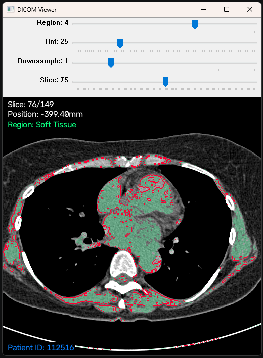
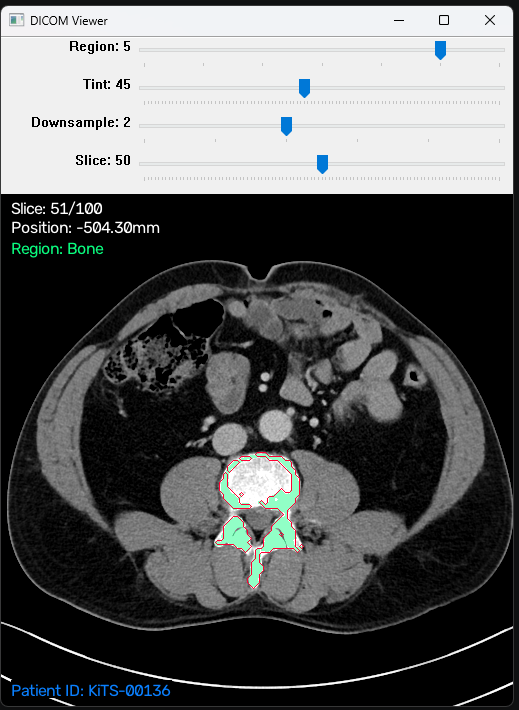

# CT Scan Anatomic Boundary Viewer

<p align="center">
  
  
</p>

A lightweight Python application for viewing and segmenting CT scans stored as DICOM files.

The viewer loads a DICOM series, sorts slices into their correct anatomical order, and allows the user to identify boundaries between tissue-density regions using Hounsfield units and a marching squares algorithm.

## Features

- Load and display DICOM CT scan series
- Navigate through individual CT slices
- Segment regions based on Hounsfield unit ranges
- Highlight selected tissue-density regions
- Generate isolines around selected regions using marching squares
- Variable downsampling
- Save the current viewer image

## Files
*Test CT scans from: https://saga-it.com/dicom/samples*

> 📂 **[`dicoms`](dicoms)/** — *DICOM CT scan series, prepoulated with test scans*
> - 📂 **[`ct-abdomen-c4kc-kits-series`](dicoms/ct-abdomen-c4kc-kits-series)/** — *Abdominal CT: C4KC-KiTS Kidney Study*
> - 📂 **[`ct-chest-lidc-idri-series`](dicoms/ct-chest-lidc-idri-series)/** — *Chest CT: LIDC-IDRI Lung Nodule Study*
> - 📂 **[`ct-pancreas-pancreas-ct-series`](dicoms/ct-pancreas-pancreas-ct-series)/** — *Pancreatic CT: Pancreas-CT Reference Study*
> - 📂 **[`lung-cancer-full-series`](dicoms/lung-cancer-full-series)/** — *Chest CT: NLST Lung Cancer Screening*
>
> 🐍 [`viewer.py`](viewer.py) — *DICOM loading, image processing, segmentation, marching squares, and viewer interface*
## Requirements

Python 3 and the following packages:

- `pydicom`
- `dicom2jpg`
- `opencv-python`
- `numpy`

Install dependencies with:

```bash
pip install pydicom dicom2jpg opencv-python numpy
```

## Usage

Place DICOM series in the `dicoms` folder, with each series contained in its own folder.:

```text
dicoms/
├── series-1/
│   ├── image001.dcm
│   ├── image002.dcm
│   └── ...
└── series-2/
    ├── image001.dcm
    └── ...
```

Run the viewer:

```bash
python viewer.py
```

Select a DICOM series when prompted. Use the viewer controls to navigate slices and adjust the segmentation.

Press `Space` to save the currently displayed image.

